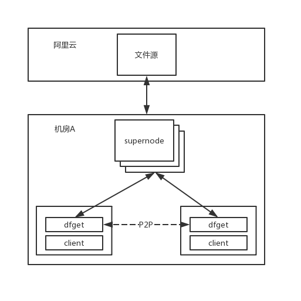

# 饿了么使用 Dragonfly 的实践

饿了么的部署环境比较复杂。环境上既有自建的机房，也有在公有云上的测试和生产环境；应用既有用容器部署的，也有使用虚拟机部署的；容器平台既有基于 mesos 自研的 AppOS，也有阿里集团的 sigma（基于 kubernetes）。随着饿了么应用规模的增加，我们的生产环境已经承载了 30000 容器实例，5000 台虚拟机，每天进行千余次发布。在这样复杂的环境下，应用的镜像、在虚拟机上使用的安装包和其他较大文件（比如业务上用到的机器学习模型文件等）的跨机房分发，就成了一件非常有挑战的事。

饿了么发布过程中用到的大部分文件存储服务都部署在阿里云上，包括镜像仓库、应用安装包仓库、yum 仓库等等，其他机房通过专线访问这些服务。在其他机房进行大并发量的发布时，如果不人为控制并发量，单实例的存储服务会因负载过高而变慢，多实例的存储服务则可能给机房与阿里云之间的专线造成极大压力，甚至对正常的业务造成影响；在流量限制下，应用的发布和镜像预热等操作都比较慢。

饿了么的镜像仓库是在饿了么开始做容器化时基于开源的 docker registry 自研的，当时 [harbor](https://github.com/goharbor/harbor) 等开源的镜像仓库都尚不成熟，我们自研的镜像仓库主要解决用户与权限的问题，并没有跨机房复制之类的功能。虽然我们的镜像仓库使用阿里云的 OSS 作为存储，但由于不想使用跨区域复制，也不能解决专线流量的限制。

基于上述背景，如果要将所有服务都做分布式改造或者选用其他替代方案以支持跨机房的分发，技术难度和工作量都很大，还会有成本控制、网络规划以及安全方面的各种问题。因此，我们希望能找到一个对现有系统改动尽量小的方案来解决分发的流量问题。

经过一段时间的调研，我们选择了 Dragonfly，从其[官网](https://d7y.io)的介绍中，可以看到以下几个特点：

> - **基于 P2P 的文件分发**：利用 P2P 技术，支持文件的大规模分发，提高文件的下载速度和成功率，有效减小带宽，尤其是跨机房带宽。
> - **无侵入支持各种容器技术**：不用修改容器服务的任何代码，只需简单配置就可使用。
> - **被动式 CDN**：利用 CDN 技术，避免重复下载同一个文件。
> - **机器级别的限流**：同一台机器上的所有任务的速率总和受限。
> - **对文件源无压力**：通常，仅有超级节点会从源下载，对源基本无压力。
> - **简单易用**：仅需简单配置，使用方式基本类似于 curl。

其中**减小跨机房带宽**、**对文件源无压力**、**无侵入**等特点完美地契合了我们的需求。理论上我们只需要在各个机房都搭建一套 Dragonfly 集群，并配置一下 docker daemon，修改发布流程中下载的流程，就能解决问题。

## 改进 Dragonfly

在我们试用 Dragonfly 时，发现了以下几个问题

- 不使用 docker 镜像时，在机器上部署不够方便
- 不能很好地支持多个镜像仓库和私有仓库
- HTTP_PROXY 功能不完善，不能支持 HTTPS 请求

饿了么

部署问题比较简单，在 [PR#419](https://github.com/dragonflyoss/Dragonfly/pull/419) 中，添加了把 dfclient 用 rpm 和 deb 打包的脚本。

多仓库、私有仓库、HTTP_PROXY 和 HTTPS 支持的问题其实
